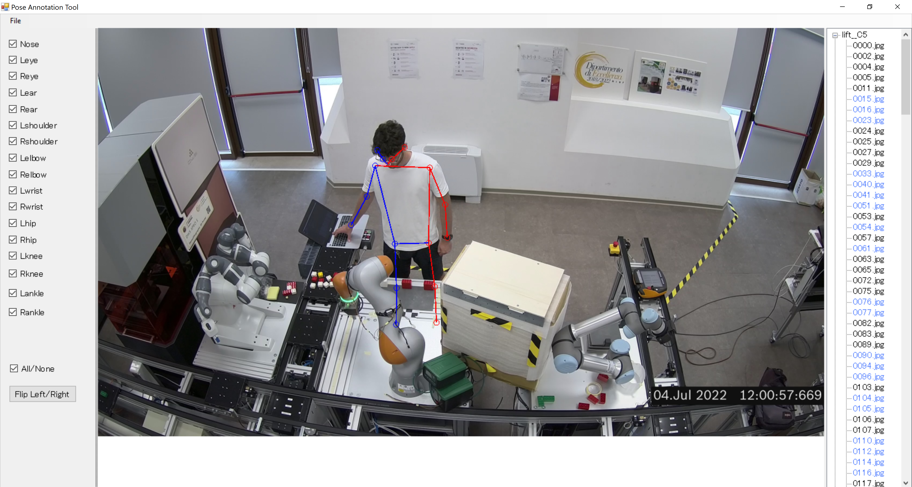

# PoseAnnotationTool

A simple 2D keypoint annotation tool. Currently it supports 17 keypoints (COCO format; see [coco 2d keypoints](http://presentations.cocodataset.org/COCO17-Keypoints-Overview.pdf)).



## How to run

1. Build the project. 
2. Place in the `.exe`  file directory a folder named "images". Example:s

```
PoseAnnotationTool.exe
images
├ folderA
   ├ imageA.jpg
   ├ imageB.jpg
   ├ ...
├ folderB
   ├ imageX.jpg
   ├ imageY.jpg
   ├ ...
├ ...
```

## Output:
For each image a `.txt` file is created:
- First row is the filename of the annotation
- For each keypoint in COCO enumeration (Keypoint in position 0 = Nose, etc...), the X,Y coordinates in pixel space.

e.g.

```
157.jpg
1237.88232421875,563.4906005859375
1251.4813232421875,524.29296875
1204.1846923828125,557.8809814453125
1257.56396484375,465.5048828125
1096.741455078125,517.9266357421875
1219.9903564453125,438.03924560546875
982.44580078125,640.55517578125
1284.760986328125,527.9609375
982.93359375,803.7445068359375
1309.1441650390625,674.4404296875
1044.750244140625,911.4112548828125
1216.0421142578125,760.0701904296875
1092.304443359375,846.31396484375
1251.94921875,791.9317626953125
1039.2445068359375,956.7545166015625
1267.7275390625,797.340087890625
1048.17236328125,1026.36328125
```

## Set a different folder
If required:
1. Replace "DefaultDataDir" in Datasets.cs with the root image folder path.
2. Then, build and run (We confirmed it works in Visual Studio 2019)

## Current limitations:
- Multi-person support
- No linux build (.NET Framework not supported in linux)
- Correct ordering in case of images with non integer filenames
- Several unhandled errors (e.g. in case of no image found)
